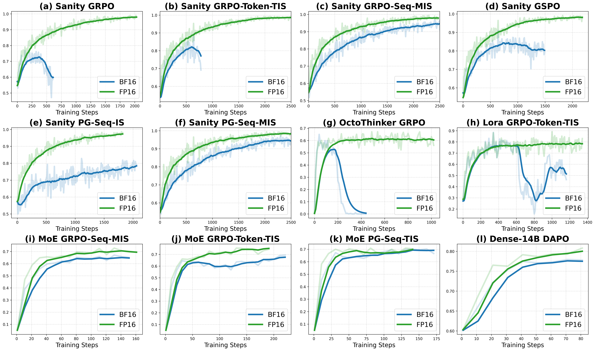
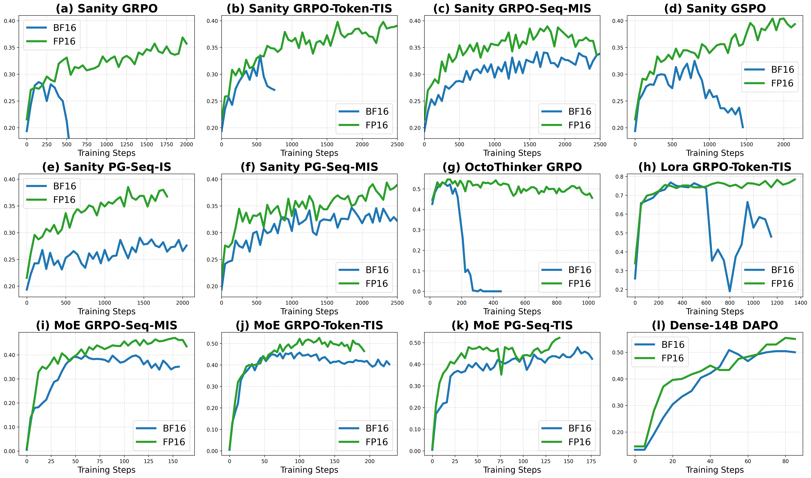
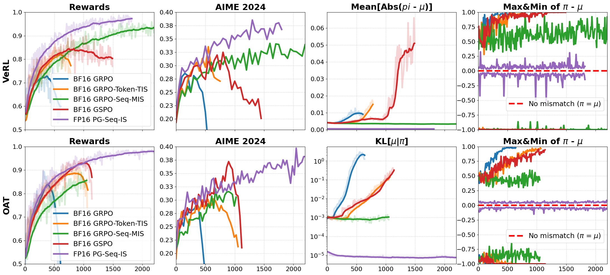
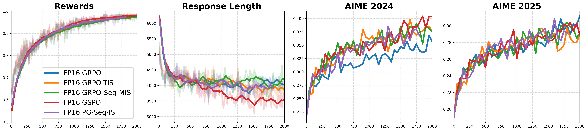
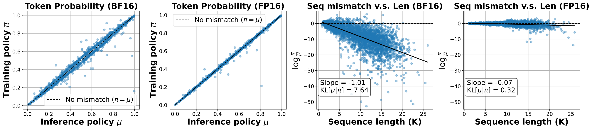

<div align="center">

# Defeating the Training-Inference Mismatch via FP16
[Penghui Qi](https://scholar.google.com/citations?user=CLRsGEMAAAAJ&hl=en), [Zichen Liu](https://lkevinzc.github.io/), [Xiangxin Zhou](https://zhouxiangxin1998.github.io/)
[Tianyu Pang](https://p2333.github.io/), [Chao Du](https://duchao0726.github.io/), [Wee Sun Lee](https://scholar.google.com/citations?user=8PCrLgwAAAAJ&hl=en), [Min Lin](https://scholar.google.com.sg/citations?user=BGONmkIAAAAJ&hl=en)

[](https://arxiv.org/pdf/2510.26788)
[](https://github.com/sail-sg/Precision-RL)

</div>

## Overview


*Figure 1: Training reward comparison between BF16 and FP16. We evaluate across diverse settings: our Sanity test with various algorithms (GRPO, GSPO, TIS, MIS, PG); different model families (R1D, Qwen and OctoThinker); alternative fine-tuning methods of Lora; and larger scale models (Dense-14B, MoE). Results are validated on two independent frameworks (VeRL and Oat).*


*Figure 2: Evaluation comparisons between BF16 and FP16 across various frameworks, algorithms, datasets and training regimes.*


*Figure 3: Simply switching from BF16 to FP16 stabilizes and prolongs RL training. The basic importance-weighted policy gradient algorithm in FP16 outperforms all baselines in BF16.*


*Figure 4: Comparisons between various algorithms based on FP16.*


*Figure 5: FP16 significantly reduces the training-inference mismatch. The left two plots show the token-level probability distribution, and the right two plots present the distribution of sequence-level log probability ratio between the inference policy ($\mu$) and the training policy ($\pi$).*


## Reproduce the Sanity Test 🎯


### OAT

Find related code in `oat` folder.

### VeRL

Find related code in `Precision-RL-verl` folder.

### Data
The sanity test dataset for [`DeepSeek-R1-Distill-Qwen-1.5B`](https://huggingface.co/deepseek-ai/DeepSeek-R1-Distill-Qwen-1.5B) is included in [`this folder`](https://github.com/sail-sg/Precision-RL-verl/tree/main/sanity_test). The data processing script will be released soon.


## Citation
If you find our works useful for your research, please consider citing:

```bibtex
@article{qi2025precisionrl,
  title={Defeating the Training-Inference Mismatch via FP16},
  author={Qi, Penghui and Liu, Zichen and Zhou, Xiangxin and Pang, Tianyu and Du, Chao and Lee, Wee Sun and Lin, Min},
  journal={arXiv preprint arXiv:2510.26788},
  year={2025}
}
```
